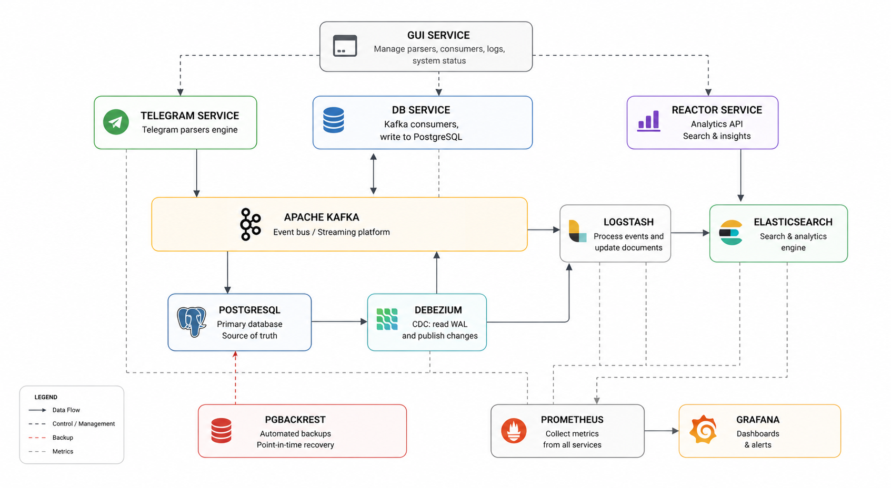

# Torin


# Telegram Analytics Platform

> Distributed event-driven platform for collecting, processing, and analyzing Telegram data at scale.

## Overview

Torin is a microservice-based Telegram analytics platform built around an event-driven architecture.

The platform collects data from Telegram, processes events asynchronously through Apache Kafka, stores the primary dataset in PostgreSQL, and synchronizes searchable data into Elasticsearch using Change Data Capture (CDC).

The system provides analytical APIs for querying and processing large volumes of collected Telegram data.

## 📊 Current Operating Scale

The system currently operates with **189 concurrently running Telegram parsers** and a PostgreSQL storage capacity of **up to 6 TB**.

| Metric | Current Value |
| --- | ---: |
| Concurrent parsers | **189** |
| PostgreSQL storage capacity | **7 TB** |
| Data processing | Continuous |
| Primary database | PostgreSQL |
| Event streaming | Apache Kafka |
| Search & analytics | Elasticsearch |

> These values represent the current operating scale of the system and are not synthetic benchmark results.

## System design



### Services

| Service | Responsibility |
| --- | --- |
| GUI Service | Manages parsers, consumers, logs, and system status |
| Telegram Service | Telegram data collection and parsing |
| DB Service | Consumes Kafka events and persists data to PostgreSQL |
| Reactor Service | Provides analytics APIs and queries Elasticsearch |

### Infrastructure

- **PostgreSQL** — Primary data store and source of truth
- **Apache Kafka** — Event streaming platform
- **Kafka Connect + Debezium** — Change Data Capture
- **Logstash** — Data transformation and synchronization
- **Elasticsearch** — Search and analytics
- **pgBackRest** — PostgreSQL backup and recovery
- **Prometheus** — Metrics collection
- **Grafana** — Monitoring and visualization

## Data Flow

```text
Telegram Service
        │
        ▼
      Kafka
        │
        ▼
   DB Service
        │
        ▼
   PostgreSQL
        │
        ▼
 Debezium (CDC)
        │
        ▼
      Kafka
        │
        ▼
    Logstash
        │
        ▼
 Elasticsearch
        │
        ▼
 Reactor Service
```

## Technology Stack

### Backend

- Java
- Spring Boot
- Spring WebFlux
- ASP.NET Core
- REST API

### Data

- PostgreSQL
- Elasticsearch

### Streaming

- Apache Kafka
- Kafka Connect
- Debezium
- Logstash

### Observability

- Prometheus
- Grafana

### Infrastructure

- Docker
- Docker Compose
- pgBackRest

## Highlights

- Microservices Architecture
- Event-Driven Design
- Asynchronous Data Processing
- Change Data Capture (CDC)
- Elasticsearch-Based Analytics
- Automated PostgreSQL Backups
- Distributed Monitoring
- Dockerized Infrastructure

## Getting Started

### Prerequisites

Make sure the following tools are installed:

- Docker
- Docker Compose

### Clone the repository

```bash
git clone https://github.com/remantadin/Torin.git
cd Torin
```

### Configure environment variables

Copy the environment variables template:

```bash
cp .example.env .env
```

Then open `.env` and fill in the required values.

> The application will not start correctly until all required environment variables are configured.

### Start the infrastructure

```bash
docker compose -p torin -f docker-compose.infra.yml up -d --build
```

To run the system in detached mode:

```bash
docker compose -p torin -f docker-compose.services.yml up -d --build
```

### Stop the system

```bash
docker compose \
  -p torin \
  -f docker-compose.infra.yml \
  -f docker-compose.services.yml \
  down
```

## Observability

The platform uses Prometheus and Grafana for monitoring infrastructure and application metrics.

The monitored components include:

- Application health
- JVM metrics
- CPU and memory usage
- Kafka metrics
- PostgreSQL metrics
- Service availability

## Project Status

The project is under active development.

Future improvements include:

- Detailed performance benchmarks
- Load testing results
- DLQ Kafka
- Kafka consumer lag analysis
- Extended observability dashboards